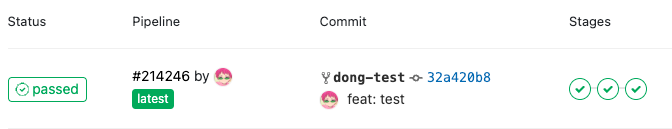
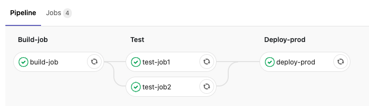
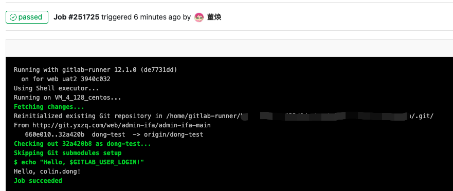

# GitLab CI/CD 快速开始

## 前言

最近新需求 需要搭建新项目 新项目需要配置流水线 涉及到了CI/CD 本文主要是基本使用方法，更加细致的说明可以查看官方文档 [极狐GitLab CI/CD | 极狐GitLab](https://docs.gitlab.cn/jh/ci/)

## GitLab CI/CD

GitLab CI/CD 是一种使用持续方法进行软件开发的工

- [持续集成 (CI)](https://docs.gitlab.cn/jh/ci/introduction/index.html#%E6%8C%81%E7%BB%AD%E9%9B%86%E6%88%90)
- [持续交付 (CD)](https://docs.gitlab.cn/jh/ci/introduction/index.html#%E6%8C%81%E7%BB%AD%E4%BA%A4%E4%BB%98)
- [持续部署 (CD)](https://docs.gitlab.cn/jh/ci/introduction/index.html#%E6%8C%81%E7%BB%AD%E9%83%A8%E7%BD%B2)

在开始之前确保拥有

- gitlab 中想使用ci/cd的项目

- 项目的维护者或者所有者角色

## CI/CD 流程概念

1.确保有可食用的runner。如果没有runner。则需要为项目或者群组安装gitlab runner并注册runner

2.在仓库的根目录下创建一个.gitlab-ci.yml文件。这是定义CI/CD作业的地方

#### 确保有可用的runner

跳转到设置>CI/CD 并展开Runners

只要您至少有一个有效的 runner，旁边有一个绿色圆圈，您就有一个 runner 可以处理您的作业

如果没有则需要注册添加gitlab runner，将在另一篇中说明如何注册gitlab runner

### 创建.gitlab-ci.yml 文件

在此文件中，定义：

- runner应执行的作业的顺序和结构

- runner 在遇到特定条件时应作出的决定

1.在想要提交的分支中，根目录下出创建一.gitlab-ci.yml 

`.gitlab-ci.yml` 文件中没有定义 `stages`，那么默认的流水线阶段是：

- [`.pre`](https://docs.gitlab.cn/jh/ci/yaml/#stage-pre)
- `build`
- `test`
- `deploy`
- [`.post`](https://docs.gitlab.cn/jh/ci/yaml/#stage-post)
1. `build` 中的所有作业并行执行。
2. 如果 `build` 中的所有作业都成功，`test` 作业将并行执行。
3. 如果 `test` 中的所有作业都成功，`deploy` 作业将并行执行。
4. 如果 `deploy` 中的所有作业都成功，则流水线被标记为 `passed`。

```yml
stages: # 流水线阶段的名称和顺序
    - build-job
    - test
    - deploy-prod
build-job: 
    stage: build-job
    only:
        refs:
            - /^dong-test$/ # 分支dong-test的时候执行
    script: # 允许脚本 
        - echo "Hello, $GITLAB_USER_LOGIN!" #
    tags: # runner tag
        - web-uat2 
test-job1:
    stage: test
    only:
        refs:
            - /^dong-test$/
    script:
        - echo "This job tests something"
    tags: 
        - web-uat2

test-job2:
    stage: test
    only:
        refs:
            - /^dong-test$/
    script:
        - echo "This job tests something, but takes more time than test-job1."
        - echo "After the echo commands complete, it runs the sleep command for 20 seconds"
        - echo "which simulates a test that runs 20 seconds longer than test-job1"
        - sleep 20
    tags: 
        - web-uat2

deploy-prod:
    stage: deploy-prod
    script:
        - echo "This job deploys something from the $CI_COMMIT_BRANCH branch."
    environment: production
    tags: 
        - web-uat2
```

`$GITLAB_USER_LOGIN` 和 `$CI_COMMIT_BRANCH` 是在作业运行时填充的预定义变量。

### 查看流水线和作业状态

当提交之后，流水线启动

- 跳转到 CI/CD > pipelines

显示对应有三个阶段的流水线



- 查看流水线可视化表，点击流水线ID



- 查看作业详情信息，点击作业名称，例如`build-job`


