## vercel + hexo 搭建个人博客

### 前言

一直想搭建一个个人博客，最近了解到使用vercel + hexo即可快速搭建个人博客，最后搭配域名即可做到国内访问自己的博客，本篇即是记录个人搭建博客的过程。如果你舍不得去购买服务器，又想使用markdown格式快速创建自己的博客，那么本篇很适合你。

### vercel

vercel:是一家提供网站托管的云平台，可以将你的项目部署在平台上，并提供网站访问。可以将github授权给vercel之后，就可以轻松且优雅的部署你的项目，只需想代码一推送，项目立马就自动更新部署。这里我们使用vercel就是为了使用vercel提供的服务器，已经方便的项目管理已经自动部署功能。

### hexo

Hexo 是一个快速、简洁且高效的博客框架。Hexo 使用 [Markdown](http://daringfireball.net/projects/markdown/)（或其他渲染引擎）解析文章，在几秒内，即可利用靓丽的主题生成静态网页。

## 搭建

在搭建个人博客之前需要一些准备工作，安装node，拥有github账号，并安装了git，本篇只讲述我跟人使用的，其他方案可自行选择。

## 登录vercel账号

首先需要进入的[vercel官网](https://vercel.com/login)

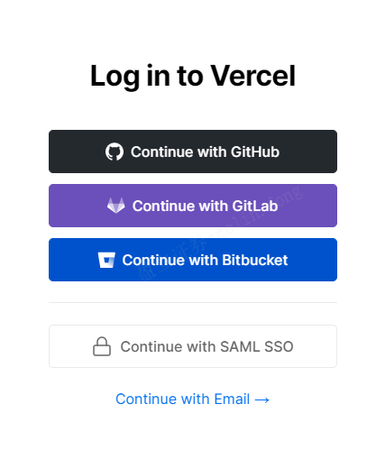

这里点击GitHub继续，使用GitHub账号登录，只需绑定手机号之后这时候你就注册并登录了vercel

## 安装hexo-cli

在安装hexo之前需要安装node，具体访问[node官网下载]()

在安装好node之后只需在命令行输入下面的指定就能简单的创建一个hexo项目

```bash
npm install hexo-cli -g //安装hexo-cli
hexo init blog //创建hexo初始博客
cd blog
npm install //安装依赖
hexo server //运行
```

输入以上指令之后你就创建好了hexo项目，并且在输入hexo server指令之后就能够在本地运行hexo为你创建的一个简单的demo

但是这时候只能够在本地运行，我们需要借助vercel发布服务器上供远端访问

## 将hexo项目上传的GitHub仓库

首先需要将该项目上传到GitHub仓库，由于我们前面通过GitHub登录vercel，所以只需将项目上传到GitHub仓库之后就能在vercel中使用该项目

进入GitHub主页,点击your repositories

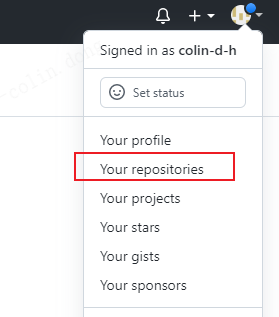

点击如图的绿色new按钮，新建仓库

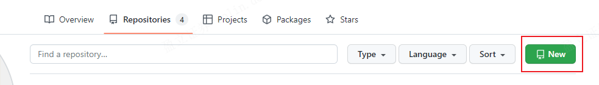

出现如下图界面，输入新建仓库名称，输入一个不与你已有仓库重名的名称，点击最下面的创建仓库

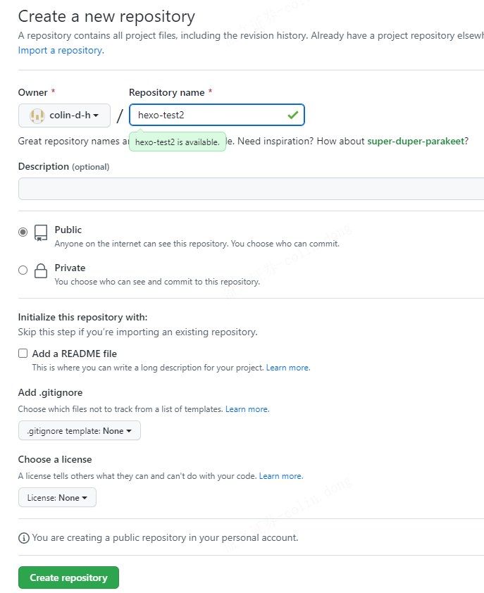

等待一会儿后，仓库就创建好了，上面的地址就是GitHub远端仓库的地址，GitHub在下方代码区域也告诉你了如何将你的代码上传到GitHub仓库

这里使用ssh连接到GitHub，如何配置ssh请自行搜索

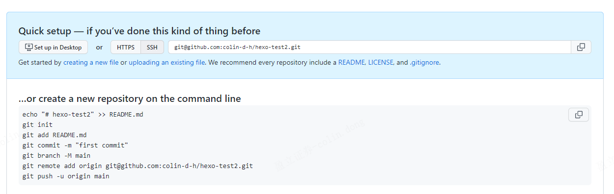

这时候进入刚刚创建的hexo blog目录下面，在git bash中输入一下命令，

```bash
cd blog //紧接上面的命令，在blog目录下
git init
git add .
git remote add origin git@github.com:colin-d-h/hexo-test2.git
git push -u origin master
```

这时候就将代码上传到GitHub仓库了，这时候我们回到刚刚登录的vercel界面

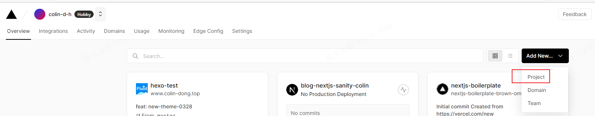

点击创建新项目

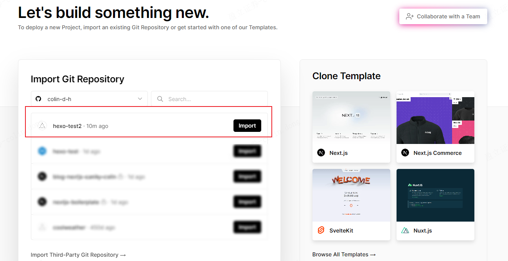

这时候就看到刚刚在GitHub创建的hexo blog项目了，点击import，这里我点击的是我先前创建好的项目

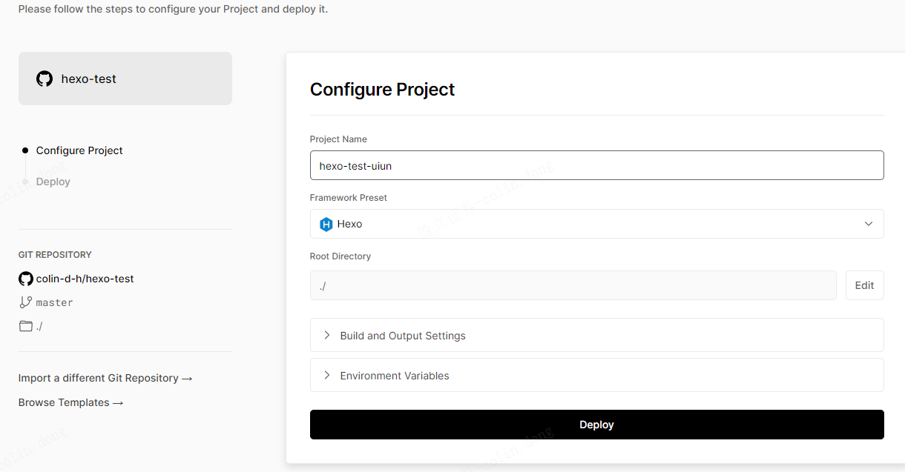

再点击deploy，大概等待一分钟不到，您就搭建好了hexo项目了

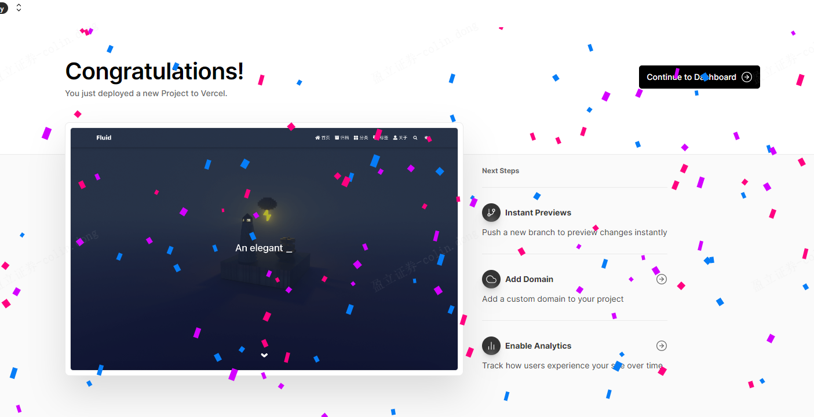

点击右上角按钮之后

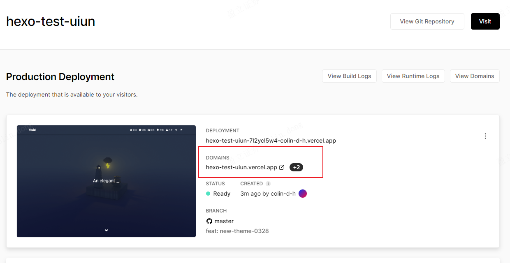

可以看到vercel为我们刚刚的项目部署到了服务器上，并且域名就是红色框框中的，这时候可以点击右上角的visit来在服务器上查看我们的项目。因为vercel的服务器在外国，如果此时你使用了魔法，你可以马上看到项目搭建的结果，如果是身处国内节点，则无法访问，那么改如何解决这个问题的？

## 配置域名达到国内访问

点击右上角的view domains，可以看到当前项目的域名

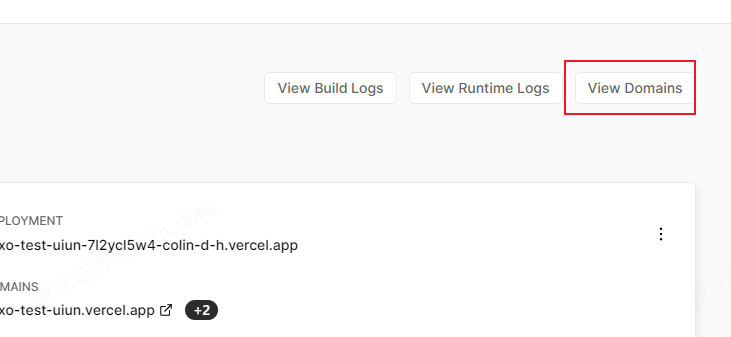

可以看到现在只有vercel为我们默认创建的

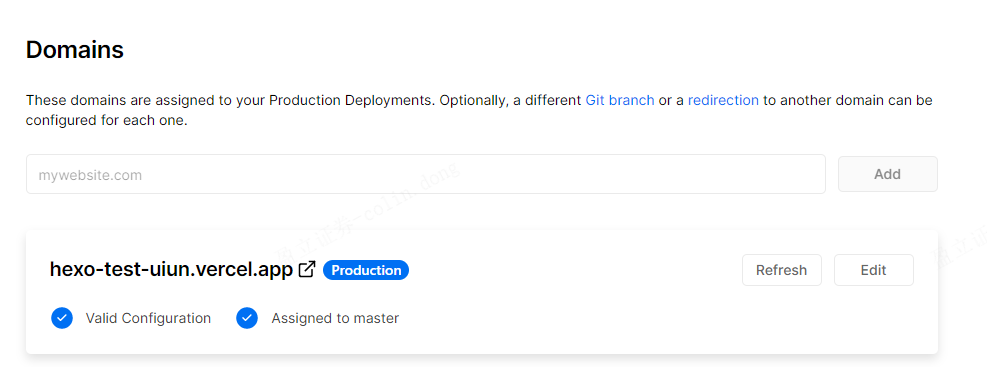

可以添加自己的域名达到国内访问

### 购买域名

这里使用[万网](https://wanwang.aliyun.com/)购买域名

登录后在右上角输入自己想要的域名


搜索后选择自己喜欢的域名，选择.top.xyz等这样的会比较便宜

跟着指示操作即可，最后在域名控制台查看购买的域名

### 域名备案

参考这篇博客[一篇域名从购买到备案到解析的详细教程 - 掘金 (juejin.cn)](https://juejin.cn/post/7052257775270756366)

目前审核中，后续更新

### 域名解析

将域名解析到服务器IP

进入域名控制台查看我们的域名,点击右下角的解析


点击添加记录


- 记录类型：选择 **A 。**

- 主机记录：一般是指子域名的前缀（如需创建子域名为www.dns-example.com, 主机记录输入 **www**；如需实现dns-example.com，主机记录输入 **@**）。

- 解析线路：选择 **默认** （默认为必选项，如未设置会导致部分用户无法访问 )。

  - 记录值：记录值为 IP 地址，填写 IPv4 地址。（服务器地址，这里我们使用的是vercel的服务器，所以要填vercel服务器的ip地址，A记录地址：`76.223.126.88` CNAME 记录地址：`cname-china.vercel-dns.com`

- TTL：为缓存时间，数值越小，修改记录各地生效时间越快，默认为10分钟。

  这里只说明了A方式，其他方式参考官方文档[添加解析记录 (aliyun.com)](https://help.aliyun.com/document_detail/29725.html?spm=a2c1d.8251892.help.dexternal.49ea5b76h7HreQ)

解析好之后，回到vercel


输入我们的域名，例如我刚刚填写的www 则我的域名是www.colin-dong.com , 如果刚刚填写的是@则是colin-dong.com 建议两种都添加

至此就能够在国能使用vercel构建我们的项目，通过域名访问博客了
